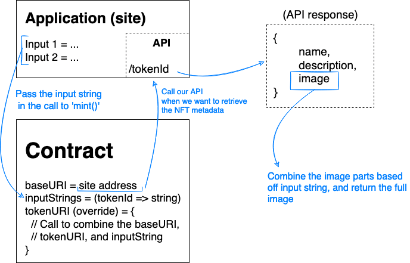

# World Congress Dev Bears

This is my project submission for the [Developer Week Europe '22 Hackathon](https://dw-europe-2022-hackathon.devpost.com).
The category that I've built this project for:

>**'WeAreDevelopers Challenge #1 - NFT Generator'**\
> NFTs are really popular! So wouldn't it be cool to have a site where users can input basic requirements and the app would provide with randomised NFT like profile pictures?

## Link to try it out: https://devbears.herokuapp.com/
## Inspiration
Initially I did some research on the sponsor for this category of the hackathon, which is 'WeAreDevelopers'. They have a large upcoming event being hosted in a few months time in Berlin called the 'World Congress' - which they say is _"the world's largest developer event"_.

That sounded quite exciting to me, and I thought that it could be cool to create a 'digital souvenir' for people attending that event. I was inspired by the Bear which has come to be recognised as the mascot of the city of Berlin, and decided to combine the two concepts which is why I decided on **World Congress Dev Bears**.

## What it does
The site allows the user to complete some simple multiple choice questions about their interests and expertise. A Dev Bear can then be generated - selecting relevant image parts based off the answers they provided, and combining these into one unique Dev Bear image.

As blockchain is still growing in popularity, I considered that not everybody will have a cryptocurrency wallet installed in their browser. The generated bear can therefore be saved as an image directly from the page.

The generated Dev Bear can also be 'minted' on the Polygon blockchain, which creates a new Non-Fungible Token (NFT) and transfers it to the user. As the smart contract inherits from the ERC721 standard contract, the generated NFT can be listed, sold, and traded around on secondary marketplaces such as OpenSea - or used as a verified NFT profile picture on Twitter.

## How it was built
I built the smart contract in Solidity and extended the ERC721 interface (standard contract for NFTs) so that my NFT would smoothly integrate with existing decentralised applications such as OpenSea (NFT marketplace).

The web application serves two purposes:
1. Front-end interface for generating and minting bears
2. API for serving appropriate metadata for the NFTs (such as name, description, image)

I created the site in React and I chose to use Next.js as the development framework around it. The site design is simple as I wanted to focus most of my efforts on the technical challenge of this project in the smart contract, and the drawing of all of the images.

## Challenges encountered
A challenge I had was that a minted NFT needed to provide a 'tokenURI' which is a URI that will return important metadata about the NFT including the name, description, and image. I've previously set the image metadata to a static file (such as one stored in a GitHub repo), but with these images being dynamic, I couldn't feasibly pre-generate every possible Dev Bear that could be made by the questions that I was asking the user.

Instead, I decided to combine the user's responses to the questions into something I called the 'inputString'. The API endpoint that I created in the site would receive this inputString when called and could use this data to choose the correct image parts to combine and generate the full Dev Bear image.

I created a simple diagram to show the flow of information between the site and contract when minting a Dev Bear:

## Accomplishments
I'm extremely proud that I managed to complete this whole thing as a one-person team! I'm still learning Solidity, so I'm proud of the clever tokenURI implementation that I chose - it helped me to learn a bit more about the inner workings of the ERC721 contract standard interface.

I'm also really proud of the idea that I came up with, as I think (should I have the opportunity to attend the World Congress event) it would be a really cool little digital souvenir to commemorate the event!

## What was learned
* I learned a lot about React which has given me more confidence in creating sites from React going forwards
* I also learned how generative NFT projects actually create their images by combining different traits. That was a tricky thing to implement, and I'm proud of the solution  that I achieved.

## What's next for World Congress Dev Bears
I'd like to improve some of the illustration and add some more traits to the DevBears to make the collection a bit more unique.

I'd also like to implement a way of storing the full image when a Dev Bear is minted, as I'm always re-generating the image from an input string, and in the case of the minted NFTs, that inputString is never going to change. It would make things a bit more efficient and is a way to optimise the code for larger volumes of traffic.

The ambitious stretch-goal is to speak to the organisers for the WeAreDevelopers World Congress, and coordinate the deployment of this so that atendees for the event can make use of this!